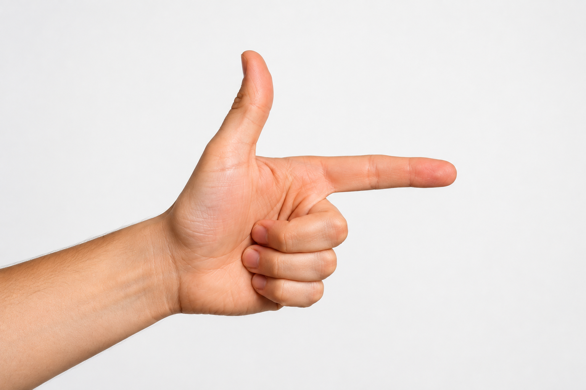
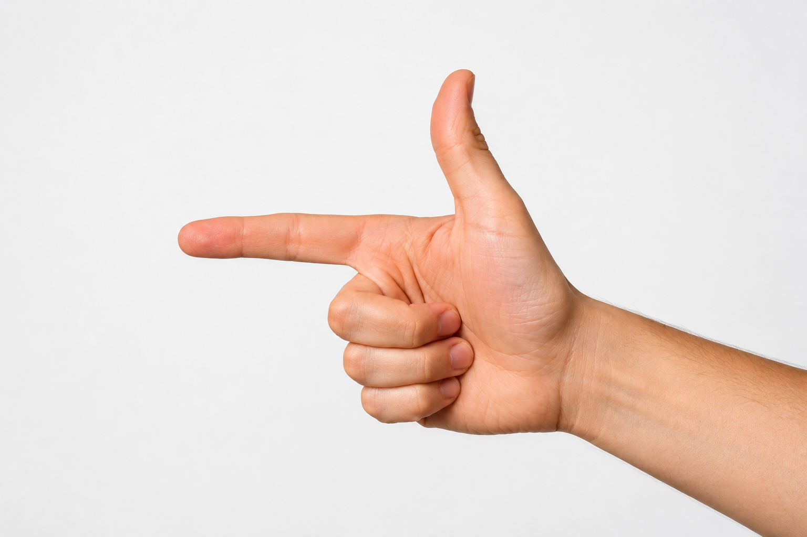
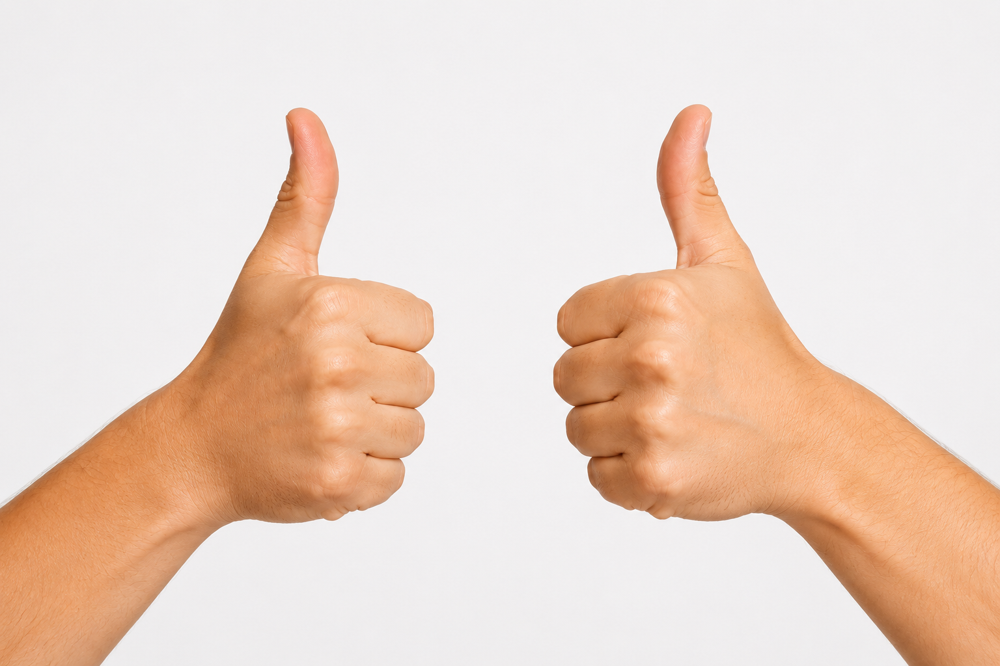
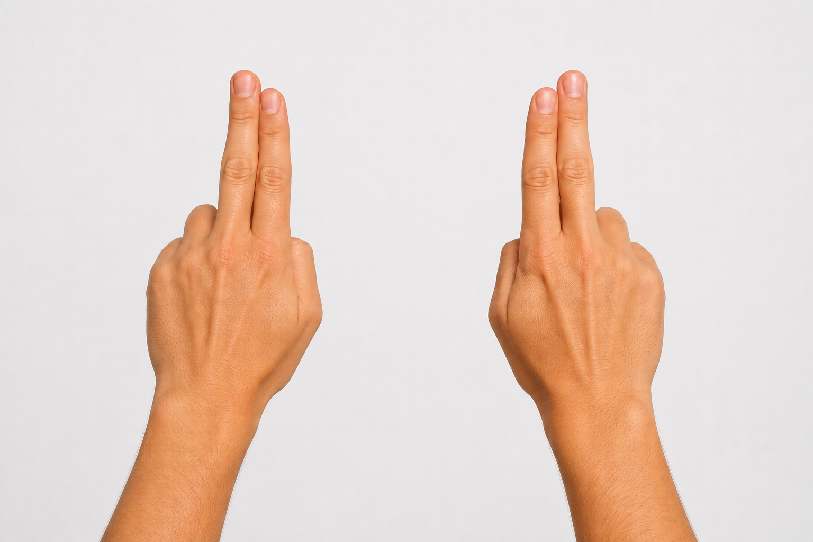
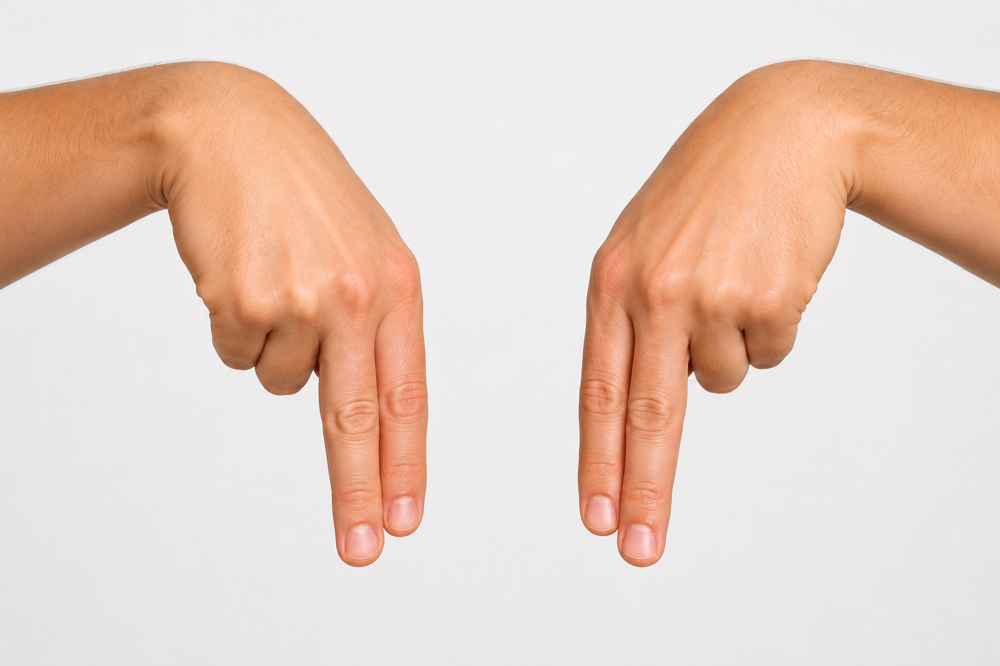
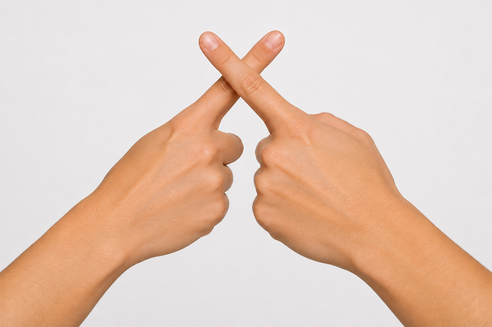

# Gesture Library

A small TypeScript library for recognizing predefined hand gestures from hand landmark data.

## Requirements

- Node.js
- npm
- TypeScript

The library itself does not access the camera and does not run MediaPipe. It receives hand landmark data as input.

## Installation

For local development, clone the repository and install the dependencies:

```bash
npm install
```

Build the library with:

```bash
npm run build
```

The compiled package is written to `dist/`.

## Basic Usage

The public API is intentionally small. Create a gesture tracker and pass the current hand landmarks to it:

```ts
import {
  createGestureTracker,
  Gestures,
} from "mi-web-technologien-beiboot-ss2026-magrund";

const tracker = createGestureTracker();

const gesture = tracker.detect({
  leftHandLandmarks,
  rightHandLandmarks,
});

if (gesture) {
  console.log(gesture.type);
}
```

`detect()` returns either a `GestureEvent` or `null`.

When no configured gesture is currently detected, the result is:

```ts
null
```

When a gesture is detected, the result contains its type, phase and duration:

```ts
{
  type: Gestures.pistolForward,
  phase: "start",
  durationMs: 300,
}
```

## Landmark Input

The library expects hand landmarks as arrays.

Each landmark has an `x` and `y` coordinate and may optionally contain `z` and `visibility`:

```ts
export interface Landmark {
  x: number;
  y: number;
  z?: number;
  visibility?: number;
}

export type LandmarkList = Landmark[];
```

The tracker accepts both hands:

```ts
tracker.detect({
  leftHandLandmarks,
  rightHandLandmarks,
});
```

The library does not produce these landmarks itself. In the current application they are designed for MediaPipe.

## Available Gestures

The library currently provides the following built-in gestures:

| Gesture | Required hands | Description |
|---|---|---|
| `Gestures.pistolForward` | One | Pistol gesture pointing forward, thumb up and index finger extended (right side) |
| `Gestures.pistolBackward` | One | Pistol gesture pointing backward, thumb up and index finger extended (left side) |
| `Gestures.bothThumbsUp` | Both | Both hands showing thumbs up |
| `Gestures.twoFingersUp` | Both | Index and middle fingers pointing up on both hands |
| `Gestures.twoFingersDown` | Both | Index and middle fingers pointing down on both hands |
| `Gestures.crossIndexFinger` | Both | Index fingers crossing each other |

<div style="display: grid; grid-template-columns: repeat(6, 0fr); gap: 20px;">

  <div>
    
    <p><code>Gestures.pistolForward</code></p>
  </div>

  <div>
    
    <p><code>Gestures.pistolBackward</code></p>
  </div>

  <div>
    
    <p><code>Gestures.bothThumbsUp</code></p>
  </div>

  <div>
    
    <p><code>Gestures.twoFingersUp</code></p>
  </div>

  <div>
    
    <p><code>Gestures.twoFingersDown</code></p>
  </div>

  <div>
    
    <p><code>Gestures.crossIndexFinger</code></p>
  </div>

</div>

**Pictures generated with ChatGPT**

## Gesture Events

A detected gesture is returned as a `GestureEvent`:

```ts
interface GestureEvent {
  type: GestureType;
  phase: GesturePhase;
  durationMs: number;
}
```

The phase can currently be:

```ts
type GesturePhase =
  | "start"
  | "hold";
```

### `start`

`start` is emitted when a gesture has been detected continuously for its configured minimum duration.

```ts
{
  type: Gestures.pistolForward,
  phase: "start",
  durationMs: 300,
}
```

### `hold`

A gesture can also emit `hold` events while it remains active if repetition is enabled.

```ts
{
  type: Gestures.pistolForward,
  phase: "hold",
  durationMs: 900,
}
```

This is useful for continuous interactions.

## Handling Gesture Actions

The library deliberately does not define application actions.

```ts
const gesture = tracker.detect({
  leftHandLandmarks,
  rightHandLandmarks,
});

switch (gesture?.type) {
  case Gestures.pistolForward:
    // Event 
    break;

  case Gestures.pistolBackward:
    // Event 
    break;
}
```

## Configuration

Each built-in gesture has a default configuration.

A gesture can be configured with `configureGesture()`:

```ts
tracker.configureGesture(
  Gestures.pistolForward,
  {
    minDurationMs: 500,
  },
);
```

The configuration is:

```ts
interface GestureConfiguration {
  enabled: boolean;
  minDurationMs: number;

  repeat?: {
    enabled: boolean;
    intervalMs: number;
  };
}
```

### Disable a gesture

A gesture can be disabled:

```ts
tracker.configureGesture(
  Gestures.bothThumbsUp,
  {
    enabled: false,
  },
);
```

Disabled gestures are ignored by the tracker.

### Change the minimum duration

The minimum duration controls how long a gesture has to be continuously detected before a `start` event is emitted:

```ts
tracker.configureGesture(
  Gestures.pistolForward,
  {
    minDurationMs: 500,
  },
);
```

A shorter duration makes gestures react faster, while a longer duration can reduce accidental activations.

### Configure repeated `hold` events

Repeated events can be configured with:

```ts
tracker.configureGesture(
  Gestures.pistolForward,
  {
    repeat: {
      enabled: true,
      intervalMs: 300,
    },
  },
);
```

With this configuration, the tracker can emit a `hold` event approximately every 300 ms while the gesture remains active.

## Default Configuration

The current built-in gestures use the following defaults:

| Gesture | Minimum duration | Repeat |
|---|---:|---|
| `pistolForward` | 300 ms | enabled, 300 ms |
| `pistolBackward` | 300 ms | enabled, 300 ms |
| `bothThumbsUp` | 300 ms | disabled |
| `twoFingersUp` | 500 ms | enabled, 250 ms |
| `twoFingersDown` | 500 ms | enabled, 250 ms |
| `crossIndexFinger` | 300 ms | disabled |

These values are defaults and can be changed for individual gestures.

## Continuous Detection
//TODO - finde ich unverständlich
The tracker is designed to be called repeatedly, for example once per camera frame:

```ts
function onFrame(
  leftHandLandmarks: LandmarkList | null,
  rightHandLandmarks: LandmarkList | null,
) {
  const gesture = tracker.detect({
    leftHandLandmarks,
    rightHandLandmarks,
  });

  if (!gesture) {
    return;
  }

  handleGesture(gesture);
}
```

The tracker maintains the state of gestures between calls.

For example, if `pistolForward` remains active:

```text
detect() → null
detect() → null
detect() → start
detect() → null
detect() → hold
detect() → null
detect() → hold
```

The exact events depend on the configured minimum duration and repeat interval.

When the gesture is no longer detected, its internal state is reset. A later activation of the same gesture can therefore produce a new `start` event.

## Using Timestamps

`detect()` optionally accepts a timestamp:

```ts
tracker.detect(
  {
    leftHandLandmarks,
    rightHandLandmarks,
  },
  timestamp,
);
```

If no timestamp is provided, the tracker uses `Date.now()`.

Passing timestamps explicitly can be useful when the application already has a timestamp associated with each camera frame.

## Public API

The library intentionally exposes only a small public API:

```ts
export {
  createGestureTracker,
} from "./tracker/GestureTracker.js";

export {
  Gestures,
} from "./gesture/GestureType.js";

export type {
  Landmark,
  LandmarkList,
} from "./types.js";
```

## Example: Complete Integration

A simplified application integration can look like this:

```ts
import {
  createGestureTracker,
  Gestures,
  type LandmarkList,
} from "mi-web-technologien-beiboot-ss2026-magrund";

const tracker = createGestureTracker();

tracker.configureGesture(
  Gestures.pistolForward,
  {
    minDurationMs: 300,
    repeat: {
      enabled: true,
      intervalMs: 300,
    },
  },
);

function processFrame(
  leftHandLandmarks: LandmarkList | null,
  rightHandLandmarks: LandmarkList | null,
) {
  const gesture = tracker.detect({
    leftHandLandmarks,
    rightHandLandmarks,
  });

  if (!gesture) {
    return;
  }

  switch (gesture.type) {
    case Gestures.pistolForward:
      if (gesture.phase === "start") {
        player.seekForward();
      }

      if (gesture.phase === "hold") {
        player.seekForward();
      }

      break;

    case Gestures.pistolBackward:
      if (gesture.phase === "start") {
        player.seekBackward();
      }

      if (gesture.phase === "hold") {
        player.seekBackward();
      }

      break;
  }
}
```

The application is responsible for obtaining the landmarks and deciding what each gesture means.

## Development

Install dependencies:

```bash
npm install
```

Build the project:

```bash
npm run build
```

The package exposes the compiled files from `dist/`.

## Limitations

The current API intentionally focuses on the existing use case.

- MediaPipe is the current landmark source used by the application.
- There is no generic landmark-provider adapter API.
- Only the built-in gestures are exposed through the public API.
- Gesture actions must be implemented by the consuming application.
